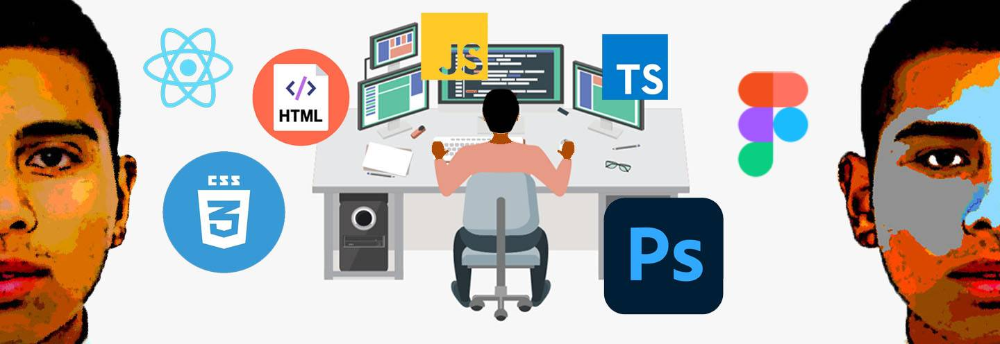

# Hi, I'm David! 👋

## Full Stack Developer | Designer | Entrepreneur 🚀

I am a **Full Stack** developer with a strong passion for **front-end** and **design**. My career has been a combination of **technology**, **design**, and **international business**, allowing me to approach projects with an integrated and creative mindset.

### My Professional Journey 💼

Throughout my career, I have worked in various fields such as **management**, **logistics**, and have carried out several **entrepreneurial ventures**, where I applied tools and knowledge acquired during my studies in **international business**. Over the past year, I have focused on developing **Full Stack** projects, testing my creativity, passion for design, and experience in **business**.

### Technical Skills ⚙️

As a developer, I work with multiple technologies and tools in both **front-end** and **back-end** development:

#### Front-end:
- **HTML5**, **CSS3**, **Tailwind**, **Bootstrap**
- **React.js**, **Next.js**, **Figma**, **Photoshop** 🎨

#### Back-end:
- **Node.js**, **Nest.js**, **Express.js**, **PHP**, **Laravel**
- **TypeScript**, **JavaScript**

#### Databases:
- **PostgreSQL**, **MongoDB** 🗄️

#### Additional Tools:
- **GitHub** (Version control)
- **Jasmine**, **Jest** (Testing)
- **CorelDraw** (Graphic design)

### What Makes Me Different? 🌟

- **Creativity**: My focus on design allows me to create unique and visually appealing user experiences.
- **Responsibility**: I consistently meet deadlines and deliver high-quality results.
- **Proactivity**: I continuously seek ways to improve processes and solutions within projects.
- **Communication**: My communication skills enable me to clearly convey ideas and collaborate effectively with others.

### What Am I Looking for Now? 🤔

Currently, I am looking to continue developing **Full Stack** projects and further learn new technologies, especially in the field of **web design** and **technological innovation**. My goal is to collaborate on projects that challenge my creativity and allow me to grow professionally while making a meaningful contribution.

### Some of My Recent Projects 🚀

- **[AgroDexports](https://github.com/DavidRocFeler/AgroDexports.git)**: B2B e-commerce application to connect suppliers from Latin America with buyers from Europe and the United States, promoting the export of agricultural products through a supervised supply chain.
Deploy: http://agrodexports.onrender.com
- **[HenryCommerce](https://github.com/DavidRocFeler/HenryCommerce.git)**: Tech product e-commerce with shopping cart and order status.
- **[Drents](https://github.com/DavidRocFeler/Drents.git)**: Application with an appointment management system to schedule meetings between property owners and tenants interested in finding rental properties to live in for a period of time.
- **[StreamD](https://github.com/DavidRocFeler/StreamD.git)**: Website to watch movie trailers through an API implemented with Mongoose NoSQL.
- **[Start4](https://github.com/DavidRocFeler/Start4.git)**: Website to offer services related to the tech industry: web design, data analysis, full-stack development, blockchain development, SEO and SEM, and community management.
Deploy: https://www.manager-start4.nl
- **[Coinveloper](https://github.com/DavidRocFeler/CoinVeloper.git)**: Coinveloper is a blog to explore the blockchain universe up close. It is divided into different sections, where you can find a learning section, a news section, and a section with articles related to various cryptocurrencies in the market. You will learn everything about blockchain and cryptocurrencies.
Deploy: https://www.coinveloper.com
- **[Busweb](https://github.com/DavidRocFeler/BusWeb.git)**: Responsive website design for a bus rental company in the Netherlands.
Deploy: https://davidrocfeler.github.io/BusWeb
---

## Let's connect! 🌍

If you'd like to know more about my projects, collaborate, or simply chat about **technology**, **design**, or **international business**, feel free to reach out.

---

**📫 Contact**: (rdpalominop@ucvvirtual.edu.pe)  
**💻 GitHub**: (https://github.com/DavidRocFeler)  
**🌐 LinkedIn**: (https://www.linkedin.com/in/davidrocfeler)

---

**Thanks for visiting my profile!** 🙌

